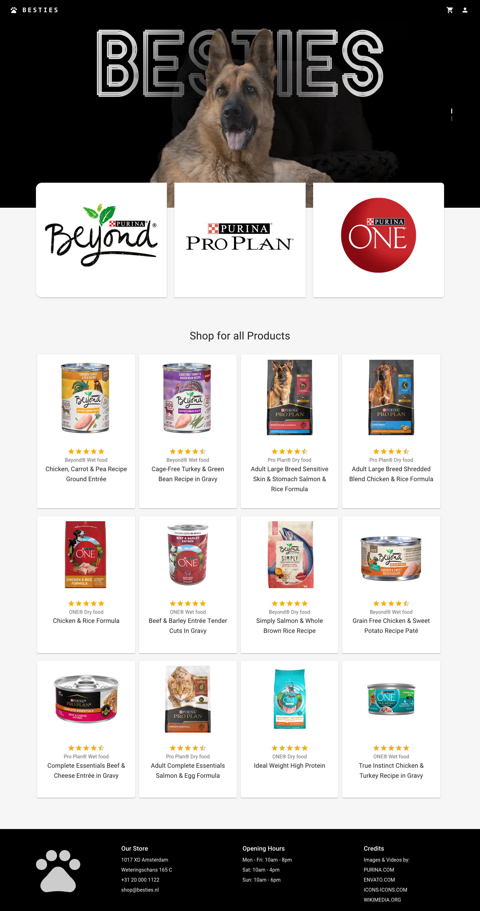

<!-- PROJECT LOGO -->

<h3 align="center">...a shop for BESTIES</h3>

<!-- TABLE OF CONTENTS -->

  
Table of Contents

  <ol>
    <li>
      <a href="#about-the-project">About The Project</a>
      <ul>
        <li><a href="#built-with">Built With</a></li>
      </ul>
    </li>
    <li><a href="#roadmap">Roadmap</a></li>
    <li><a href="#authors">Developers</a></li>
  </ol>

<!-- ABOUT THE PROJECT -->
## About The Project

This project involves building a back-end system that creates a server and connects it to a database, with the aim of enabling the front-end to interact with the database and perform certain functionalities. The backend will include creating at least five products in the database using the POST method, designing a system that allows the front-end to retrieve the list of products, enabling users to register and login using their email and password, and allowing users to update their information, such as changing their username. Additionally, users should be able to order products on the front-end, send order information to the database, and view their previous orders. The goal is to develop a robust backend system that facilitates effective communication between the front-end and the database, while allowing users to perform functionalities seamlessly.

### Built With

* ![HTML5][HTML5]
* ![CSS3][CSS3]
* ![TypeScript][TypeScript]
* ![Material-UI][Material-UI]
* ![React][React.js]
* ![Redux][Redux]
* ![React Router][React Router]
* ![Node.js][Node.js]
* ![Express.js][Express.js]
* ![MongoDB][MongoDB]

(<a href="#readme-top">back to top</a>)

<!-- ROADMAP -->
## Roadmap

- [ ] The user can register/login
- [ ] The user can login
- [ ] The user can add products to Favorites
- [ ] The user can add products to Cart
- [ ] The user can place order and see order's information
- [ ] The user can update personal information
- [ ] The user can lgout

(<a href="#readme-top">back to top</a>)

<!-- AUTHORS -->
## Developers:

* [Dragos]

(<a href="#readme-top">back to top</a>)

<!-- MARKDOWN LINKS & IMAGES -->
<!-- https://www.markdownguide.org/basic-syntax/#reference-style-links -->
[HTML5]: https://img.shields.io/badge/HTML-239120?style=for-the-badge&logo=html5&logoColor=white
[CSS3]: https://img.shields.io/badge/CSS-239120?&style=for-the-badge&logo=css3&logoColor=white
[TypeScript]: https://img.shields.io/badge/TypeScript-007ACC?style=for-the-badge&logo=typescript&logoColor=white
[Material-UI]: https://img.shields.io/badge/Material--UI-0081CB?style=for-the-badge&logo=material-ui&logoColor=white
[React.js]: https://img.shields.io/badge/React-20232A?style=for-the-badge&logo=react&logoColor=61DAFB
[Redux]: https://img.shields.io/badge/Redux-593D88?style=for-the-badge&logo=redux&logoColor=white
[React Router]: https://img.shields.io/badge/React_Router-CA4245?style=for-the-badge&logo=react-router&logoColor=white
[Node.js]: https://img.shields.io/badge/Node.js-43853D?style=for-the-badge&logo=node.js&logoColor=white
[Express.js]: https://img.shields.io/badge/Express.js-404D59?style=for-the-badge
[MongoDB]: https://img.shields.io/badge/MongoDB-4EA94B?style=for-the-badge&logo=mongodb&logoColor=white

[Dragos]: https://github.com/hellodrvgos
